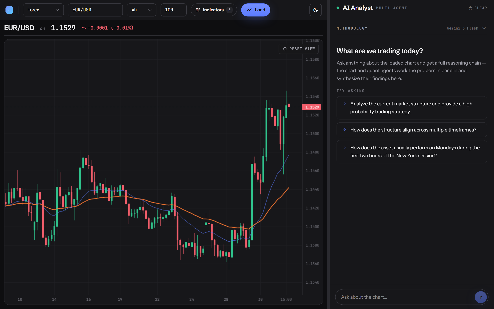
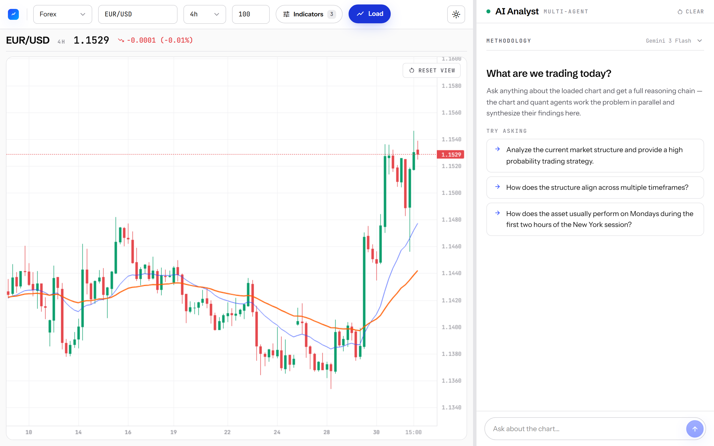
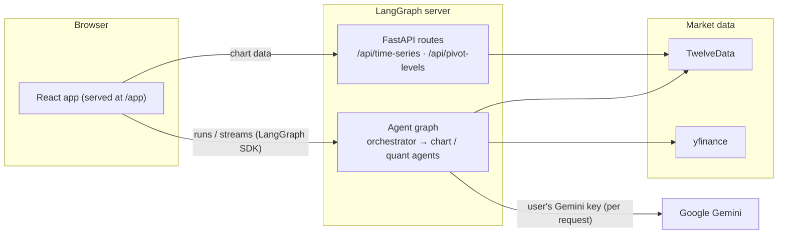

# Tradable Mind

**AI-powered market analysis copilot**

Configure a live chart, then chat with a multi-agent analyst that *sees* the chart, runs quantitative analysis on the underlying data, and answers with a full reasoning chain — not a black-box signal.

**Try it live → [www.tradablemind.com](https://www.tradablemind.com)** — no account needed, just a [Google Gemini API key](https://aistudio.google.com/apikey) (paid tier; the key never leaves your browser except to call Gemini).



<details>
<summary>Light theme</summary>



</details>

## What it does

- **Interactive charting** — candlesticks for forex, crypto, indices and more (TradingView lightweight-charts), with EMA, Bollinger Bands, RSI and other TA-Lib indicators, plus session-aware daily pivot levels.
- **Multi-agent analysis** — an orchestrator agent plans the work with todos and delegates to specialists:
  - a **chart agent** that renders the chart server-side and analyzes the *image* with Gemini vision in two stages (describe → interpret);
  - a **quant agent** that writes and executes Python against the downloaded time series for statistical questions ("how does EUR/USD usually behave on Mondays in the first two NY hours?").
- **Transparent reasoning** — every answer streams back as the full chain of agent steps, so you see *why*, not just *what*.
- **Bring your own key** — the app has no accounts and stores nothing server-side; each run is powered by the caller's own Gemini API key.

## Architecture

One LangGraph server image serves the entire app — agents, chart data API, and the built React frontend:



**Stack:** LangGraph + LangChain (Python), Google Gemini, FastAPI, TA-Lib, TwelveData + yfinance · React 19, TypeScript, Vite, Tailwind 4, lightweight-charts, Zustand.

## Run it locally

Prerequisites: **Node 20+**, **[uv](https://docs.astral.sh/uv/)**, a free [TwelveData API key](https://twelvedata.com/), and a Gemini API key (entered in the UI, paid tier).

```bash
# 1. Build the frontend (output: backend/frontend_dist, served by the backend)
cd frontend
npm install
npm run build

# 2. Configure and start the backend
cd ../backend
echo "TD_API_KEY=your_twelvedata_key" >> .env
uv sync                  # installs deps incl. the TA-Lib wrapper
uv run langgraph dev
```

Open **http://localhost:2024/app/** (trailing slash matters), paste your Gemini key, and load a chart.

For frontend-only iteration, run `npm run dev` in `frontend/` (Vite dev server, talks to the backend on port 2024 — keep it running).

### Docker (production-like)

`langgraph build` produces the same image the cloud runs — including the TA-Lib C compile:

```bash
cd frontend && npm run build           # image bakes in backend/frontend_dist
cd ../backend
uv run langgraph build -t tradable-mind
uv run langgraph up --wait --image tradable-mind:latest   # brings up Postgres + Redis
```

Then open **http://localhost:8123/app/**. Tear down with `docker compose -p backend down`.

## Deployment

The live app runs this exact image on LangGraph Managed Cloud behind [tradablemind.com](https://www.tradablemind.com). It is deliberately keyless: anonymous auth accepts all requests, and cost stays bounded because every agent run is billed to the caller's own Gemini key.

## About

Built by **Xifan Wang** — AI engineering meets markets, as a personal project and playground for multi-agent systems.

[GitHub](https://github.com/xifan828) · [LinkedIn](https://www.linkedin.com/in/dr-xifan-wang-786896182/) · [X @xifan828](https://x.com/xifan828)

Licensed under MIT.
